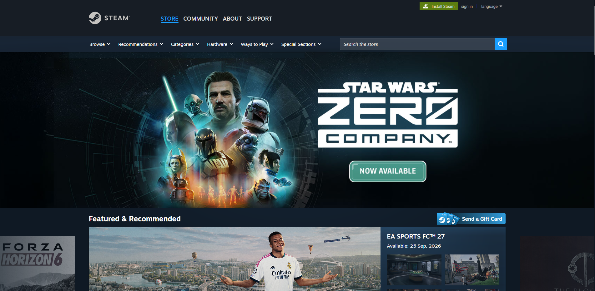

# <a target="_blank" href="https://store.steampowered.com/">Steam</a> UI Autotests (TypeScript + Playwright) — Pet Project by depedence



TypeScript/Playwright-порт пет-проекта [Steam_UI_autotests](https://github.com/valentine-qa/Steam_UI_autotests) — UI-автотесты интернет-магазина Steam. Третья итерация проекта (после [Python/Selene](https://github.com/valentine-qa/Steam_UI_autotests) и [Java/Selenide](https://github.com/depedence/steam-ui-autotests-java) версий), переписанная на TypeScript/Playwright. Проект демонстрирует навыки тестирования, понимание кода, CI/CD и работы с Allure-отчётами.

---

### Check list of autotests

1. Search game by title.
2. Moving to login page.
3. Add tag filter on search page.
4. Remove tag filter on search page.
5. Clear multiple tag filters.
6. Demo tests (intentional fail/skip) — to demonstrate different statuses in Allure report.

---

### Used Tools

        

---

### Project structure

```
src/
├── pages/
│   ├── MainPage.ts
│   ├── SearchPage.ts
│   ├── LoginPage.ts
│   └── FilterPage.ts
└── config/
    └── env.ts               # reads .env / environment variables (base URL)
tests/
├── search.test.ts
├── login.test.ts
├── filters.test.ts
└── smoke-demo.test.ts       # intentional fail/skip demo tests
playwright.config.ts         # baseURL, retries, reporter (allure), locale, screenshots/video/trace
Jenkinsfile
```

---

### How to run locally

**Prerequisites:** Node.js 18+, npm, Docker Desktop (optional, only for running the CI pipeline locally).

1. Clone the repository:
   ```bash
   git clone https://github.com/depedence/steam-ui-autotests-typescript.git
   cd steam-ui-autotests-typescript
   ```

2. Copy `.env.example` to `.env` — no changes needed for local run.

3. Install dependencies and browsers:
   ```bash
   npm ci
   npx playwright install chromium
   ```

4. Run tests:
   ```bash
   npx playwright test
   ```

5. View the Allure report:
   ```bash
   npx allure serve allure-results
   ```

---

### Run autotests with Jenkins

The project includes a `Jenkinsfile` for a declarative Jenkins Pipeline. Unlike the Java/Selenide version, no separate browser grid (Selenoid) is required — the pipeline runs tests directly inside the official `mcr.microsoft.com/playwright` Docker image, which already ships with all required browsers.


#### Pipeline stages

1. **Checkout** — clone the repository.
2. **Install & Test** — runs inside the Playwright Docker agent: `npm ci` (with retry for flaky network conditions) and `npx playwright test`.
3. **Report** — pass Allure results back to the main Jenkins agent.
4. **Post: Allure** — generate and archive the Allure report via the Allure Jenkins plugin (runs on the main agent, since Allure CLI requires Java, which the Playwright image doesn't include).

---

### Allure report

#### Overall result


#### Test results with screenshots, video and trace


#### Graphs


---

### Note on the "Cart" tests

The original Python project tested add/remove/clear cart scenarios. Steam now requires an authenticated session to modify the cart, and automating login through the UI is deliberately avoided (risk of CAPTCHA / Steam Guard / bot detection). Instead, this project tests an equivalent stateful CRUD-like scenario that doesn't require authentication: adding, removing, and clearing tag filters on the store search page.

---

### License

Distributed under the MIT License.
